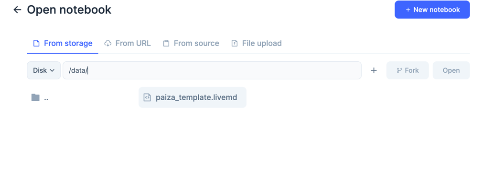
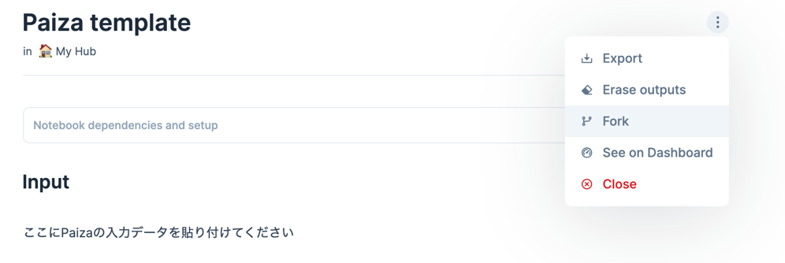
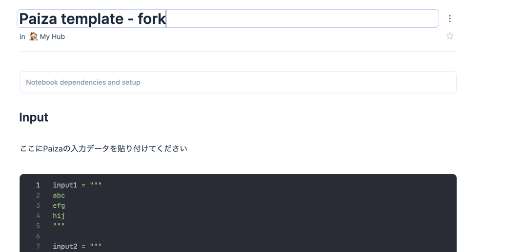

# Elixir Livebook for Paiza

# Motivation

I wanted to be able to solve paiza(https://paiza.jp/) by Elixir, and show result running in a local device.

# Requirement

- docker
- asdf

# Getting Start

1. fork this template repository. Click `fork` button on repository page header.
2. Your forked repository make it `Private Repository`. Paiza claims **DO NOT PUBLISH PROBLEMS AND THE ANSEWER**. Please follow the rules.

3. Clone forked repository.

```shell
git clone git@github.com:makoto-developer/elixir-livebook-paiza.git
```

4. import asdf modules

```shell
asdf install


# if you got not found plugins, execute this command.
asdf plugin add elixir
asdf plugin add erlang
```

5. create `.env` file

```shell
cp .env.example .env


# edit secret, port, other configs, if you need.
vi .env
```

6. edit docker-compose.yml, if you need password when livebook starting auth.

```shell
vi docker-compose.yml

# false to true, if you want auth.
# - LIVEBOOK_TOKEN_ENABLED=false
# remove comment out if you need auth.
#- LIVEBOOK_PASSWORD=${LIVEBOOK_PASSWORD}
```

7. Start docker compose.

```shell
dockcer compose up -d
```

Finish docker compose if you finish work.

```shell
dockcer compose stop
```

You start livevook next time.

```shell
docker compose start
```

# Livebook

1. When you want solve paiza problem, First of all, open paiza template book. Click `Open` Button.


2. select `paiza_template.livemd`



3. fork paiza



4. Rename livebook name, and you are ready to solve. Enjoy Paiza problems!😍



# References

- https://livebook.dev/
